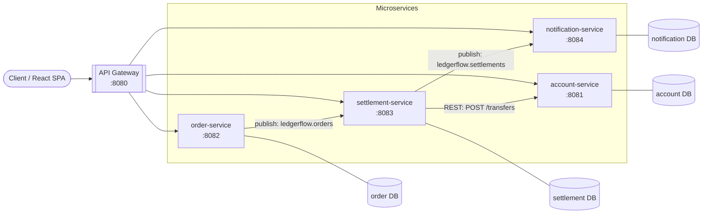

[](https://github.com/tim-rogger/ledgerflow/actions/workflows/ci.yml)

# LedgerFlow

**Event-driven payment & settlement platform that moves money correctly** — a double-entry ledger with optimistic locking, idempotent settlement, and a Kafka-based choreography across independent Spring Boot microservices, each with its own database.

Built with **Java 21** and **Spring Boot 3.3**. Runs fully offline on in-memory H2 — no Docker, no broker required for development and tests.

## Architecture



The happy path: a client creates an **order**, which emits an event on the `ledgerflow.orders` topic. The **settlement-service** consumes it, calls **account-service** over REST to execute the transfer against the double-entry ledger, persists an idempotent settlement record, and publishes to `ledgerflow.settlements`. The **notification-service** consumes that and records a notification. Every service owns its own database — nothing shares tables.

## Features

- **Double-entry ledger** — every transfer produces balanced debit/credit ledger entries; money is always `BigDecimal`.
- **Optimistic locking** — account balances are guarded by a JPA `@Version` column, so concurrent transfers cannot corrupt balances.
- **Idempotency** — settlements are keyed by a unique idempotency key; replaying the same event is a no-op, not a double charge.
- **Event-driven choreography** — services are decoupled through Kafka topics (`ledgerflow.orders`, `ledgerflow.settlements`).
- **Database-per-service** — independent schemas keep the services autonomous and independently deployable.
- **OpenAPI** — interactive Swagger UI per service via springdoc.
- **Observability** — Actuator health/info plus Prometheus metrics, ready to scrape into Grafana.
- **Containerized** — a Dockerfile per service and gateway for the full stack.
- **CI** — GitHub Actions builds and verifies every push and pull request.

## Tech stack

| Area | Technology |
|---|---|
| Language | Java 21 |
| Framework | Spring Boot 3.3 |
| API gateway | Spring Cloud Gateway |
| Messaging | Apache Kafka (Spring Kafka) |
| Persistence | Spring Data JPA / Hibernate |
| Database | PostgreSQL (prod) · H2 in-memory (dev & test) |
| API docs | springdoc OpenAPI / Swagger UI |
| Metrics | Micrometer + Prometheus |
| Dashboards | Grafana |
| Build | Maven (multi-module) |
| CI | GitHub Actions |
| Frontend | React (planned) |

## Run locally (H2, no Docker)

Every service defaults to an in-memory H2 database, so you can run any one of them on its own.

```bash
mvn -B -f account-service/pom.xml clean package
java -jar account-service/target/account-service-0.1.0-SNAPSHOT.jar
```

Then open the built-in dashboard at **http://localhost:8081** and Swagger UI at **http://localhost:8081/swagger-ui.html**.

The other services start the same way on their own ports (8082–8084). Kafka is optional for local development — the REST endpoints work without a running broker; only the cross-service event flow needs one.

## Run full stack (Docker)

Each service and the gateway ship with a Dockerfile. Bring the whole platform up — gateway, all four services, Kafka, and PostgreSQL — with:

```bash
docker compose up --build
```

Then reach everything through the gateway at **http://localhost:8080**.

## API overview

All routes are reachable directly on each service and through the gateway at `:8080`.

| Method | Path | Service | Description |
|---|---|---|---|
| `POST` | `/accounts` | account | Create an account |
| `GET` | `/accounts` | account | List accounts |
| `GET` | `/accounts/{id}` | account | Get one account |
| `POST` | `/accounts/{id}/deposit` | account | Deposit funds |
| `POST` | `/transfers` | account | Execute a ledger transfer |
| `POST` | `/orders` | order | Create a payment order |
| `GET` | `/orders/{id}` | order | Get an order |
| `POST` | `/settlements` | settlement | Settle an order (idempotent) |
| `GET` | `/settlements/{id}` | settlement | Get a settlement |
| `POST` | `/notifications` | notification | Create a notification |
| `GET` | `/notifications/unread` | notification | List unread notifications |
| `POST` | `/notifications/{id}/read` | notification | Mark a notification read |

## Services & ports

| Service | Port | Responsibility | Database |
|---|---|---|---|
| gateway | 8080 | Single entry point, routing, CORS | — |
| account-service | 8081 | Accounts & double-entry ledger, transfers (optimistic locking) | account |
| order-service | 8082 | Payment orders; publishes `ledgerflow.orders` | order |
| settlement-service | 8083 | Idempotent settlement + audit; calls account over REST; publishes `ledgerflow.settlements` | settlement |
| notification-service | 8084 | Consumes `ledgerflow.settlements`, records notifications | notification |

## License

[MIT](LICENSE) © 2026 Tim Rogger
